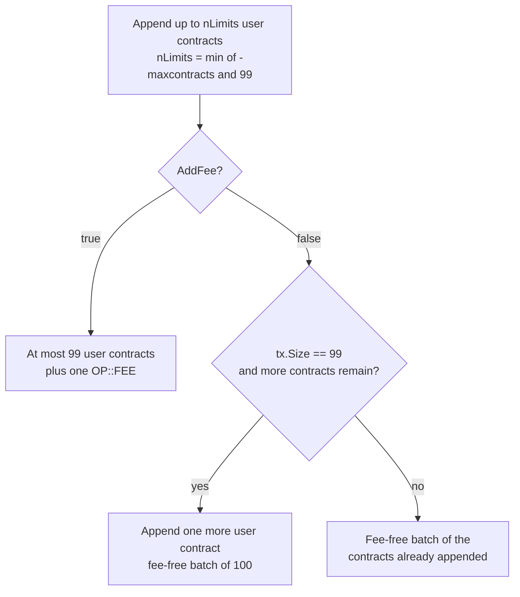
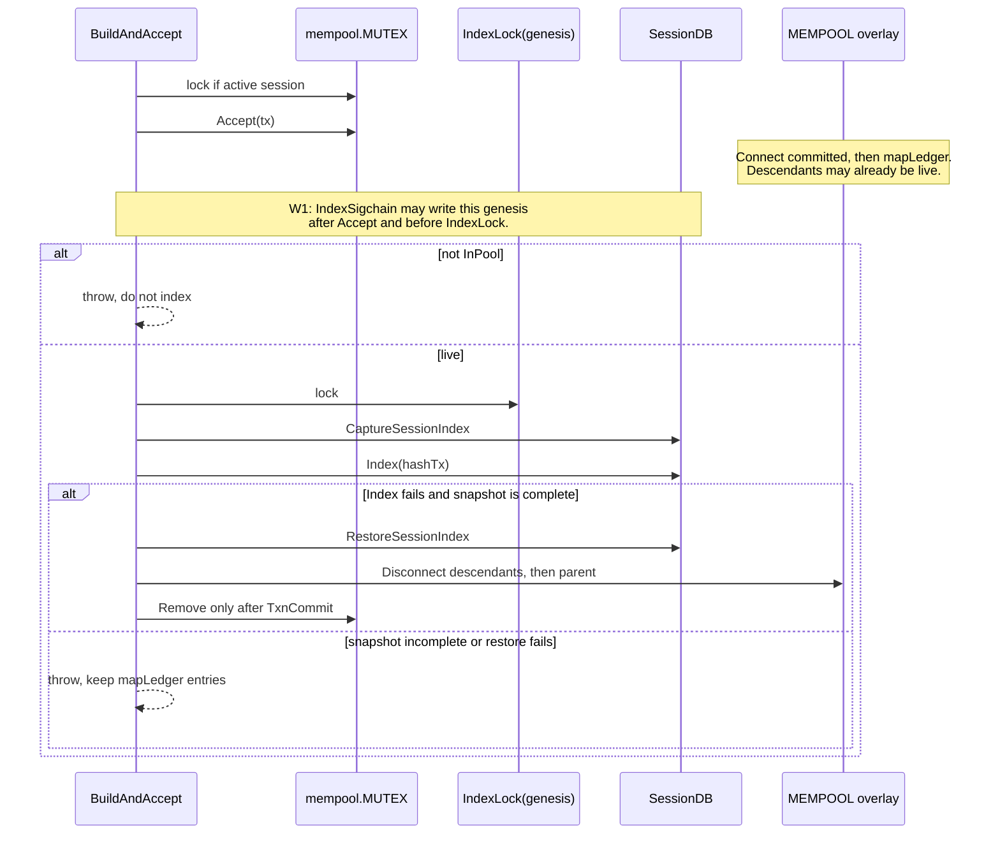
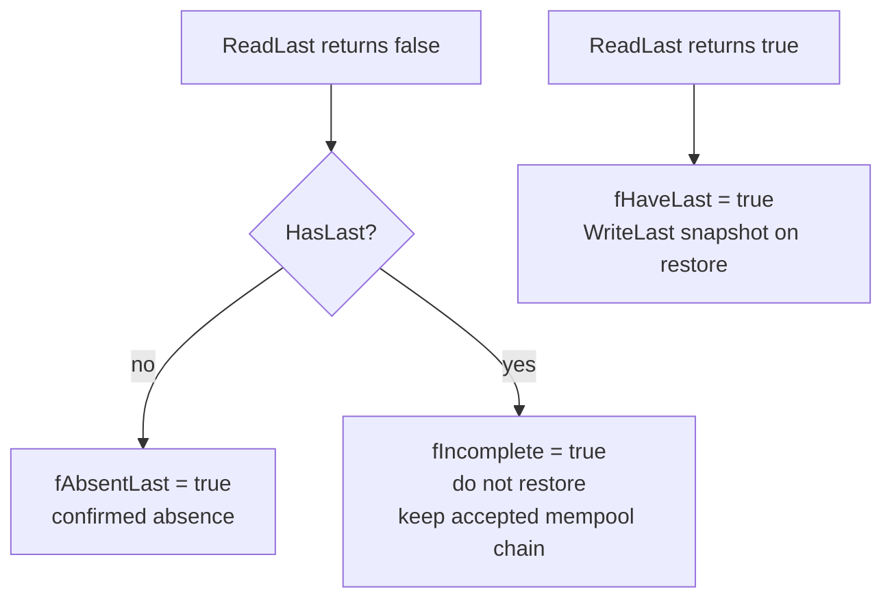
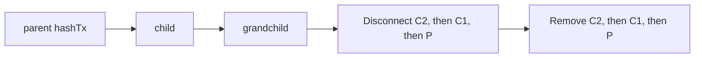
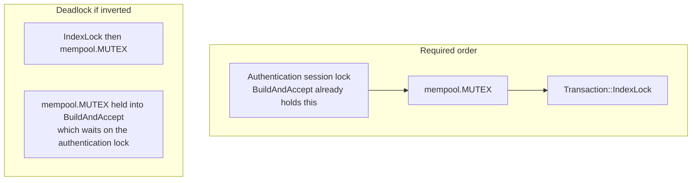
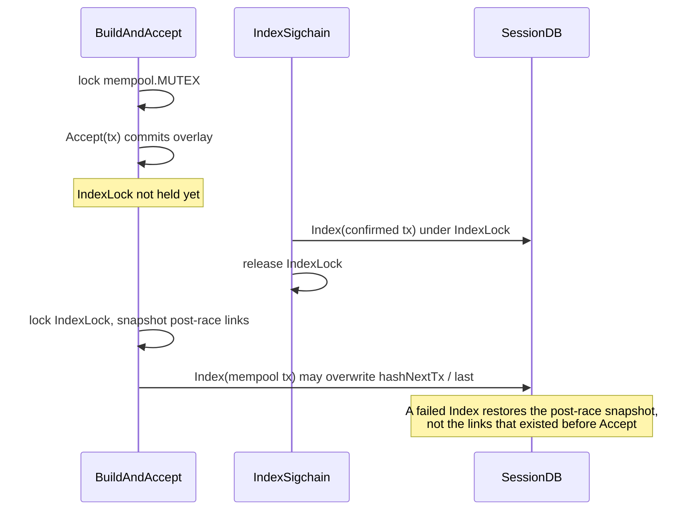
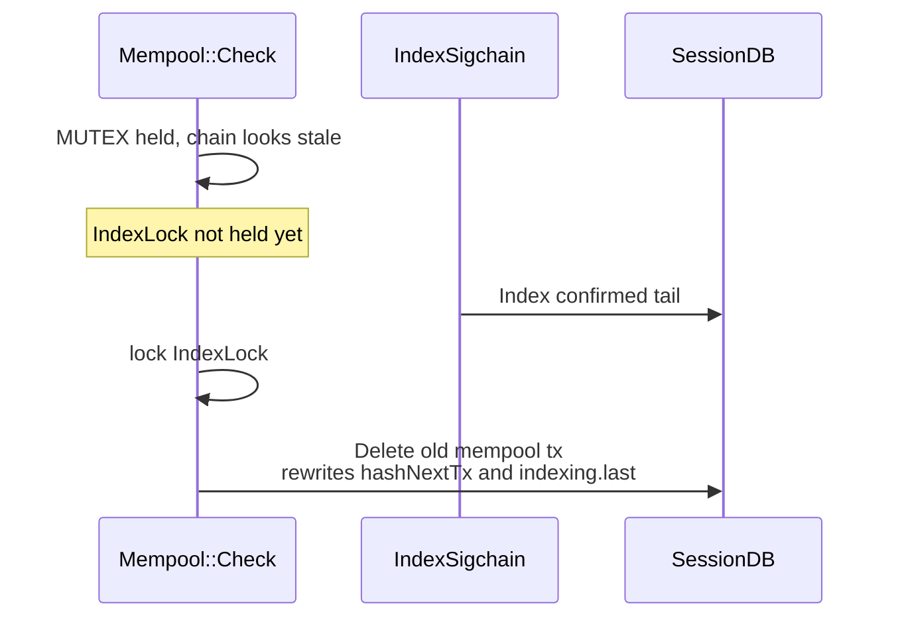

# `build.cpp` semantics

**Status:** Current on NODE5  
**Scope:** `src/TAO/API/build.cpp` (`BuildAndAccept` and its session-index rollback), plus the locks it shares with `src/TAO/API/transaction.cpp`, `src/TAO/API/notifications.cpp`, and `src/TAO/API/indexing/`  
**Related:** [Mempool semantics](MEMPOOL.md)

This document is the normative description of how the API builds, accepts, indexes, and rolls back a Tritium transaction. Later agents must not "simplify" the failure path back to `Transaction::Delete()` or `mempool.Remove()` alone.

---

## 1. What `BuildAndAccept` does

`BuildAndAccept` turns a contract list into one or more signed transactions and admits each one to the mempool. The batch is not a single 99-contract cap.

| Path | User contracts | Extra contract |
|------|----------------|----------------|
| Fee required (`AddFee` returns true) | at most `nLimits` (default 99, hard cap 99) | one `OP::FEE` appended by `AddFee` |
| No fee, the built batch already has 99 contracts, and more user contracts remain | 99 from the loop, then one more | the 100th user contract |
| No fee, and the batch is smaller than 99 | only the contracts the loop appended | none |

`nLimits` is `min(-maxcontracts, 99)`, default 99. The append loop never places more than `nLimits` contracts into `vBuild`. The 100th user contract is not part of that loop. It is appended only when all three of these are true (`build.cpp`, the `AddFee` failure branch):

1. `AddFee(tx)` returns false. No fee contract was added.
2. `nIndex < vContracts.size()`. Another user contract is waiting.
3. `tx.Size() == 99`. The transaction already holds 99 contracts.

A fee-free batch may therefore contain 100 user contracts. A fee-bearing batch may contain 99 user contracts plus the fee. A smaller `-maxcontracts` does not enable the extra append: that append checks `tx.Size() == 99`, not `nLimits`.

Per batch, after `CreateTransaction`, contract append, `AddFee`, `Build`, and `Sign`:

1. If `Authentication::Active(tx.hashGenesis)`, lock `mempool.MUTEX` **before** `Accept`. Hold it until indexing and any rollback finish.
2. `mempool.Accept(tx)`. This commits `Connect(FLAGS::MEMPOOL)` before inserting `mapLedger`, and may also admit orphan or conflict-dependent descendants. See [MEMPOOL.md](MEMPOOL.md).
3. If there is no active API session, return the hash. Do not index.
4. If the session is active but `!mempool.InPool(hashTx)`, throw. `Accept` can return true for a transaction that was never inserted into `mapLedger`. Do not snapshot or index that hash.
5. Lock `Transaction::IndexLock(tx.hashGenesis)` (pool lock already held).
6. Snapshot the SessionDB links `Index()` can mutate. This snapshot is **post-accept**. It is not the state that existed before `Accept`, and it is not synchronized with merkle `IndexSigchain` (window W1 below).
7. `TAO::API::Transaction::Index(hashTx)`.
8. On index failure, restore the snapshot. Only if that restore succeeds, disconnect the claimed descendant chain and the parent, commit that memory transaction, then `Remove` the maps.
9. On snapshot or restore failure, **leave the accepted mempool entries in place** and throw.

---

## 2. Why `Index()` cannot be rolled back with `Delete()`

`Transaction::Index()` is not one atomic write. It returns false after the first failed step, leaving earlier writes committed:

| Step | Not first | First transaction |
|------|-----------|-------------------|
| 1 | Read previous tx, set `hashNextTx`, `WriteTx(prev)` | `WriteFirst(genesis, hash)` |
| 2 | `WriteTx(hash, *this)` | `WriteTx(hash, *this)` |
| 3 | If `hashNextTx == 0`, `WriteLast(genesis, hash)` | same |

`hashNextTx == 0` on the transaction being indexed means this call is publishing the sigchain tip. `Index()` does not publish `WriteLast` when it returns false: the last-link write is the last SessionDB mutation, and a failed `WriteLast` returns before it commits.

`Transaction::Delete()` uses the same non-atomic shape (rewrite previous or erase first/last, then erase the tx, then deindex). A failed `Delete()` can leave a partial sigchain. The failure path in `build.cpp` must **not** call `Delete()`. It restores the pre-index snapshot instead.

`index_registers()` runs only after those writes, and only when the tx is already ledger-indexed (`nStatus == ACCEPTED`). It logs warnings; it does not fail `Index()`.

---

## 3. Snapshot rules

`CaptureSessionIndex` / `RestoreSessionIndex` are file-local. They exist because SessionDB `Read*` returns false for **both** a missing key and an existing value that cannot be deserialized.

| Record | Existence check | Readable value | Confirmed absent |
|--------|-----------------|----------------|------------------|
| Previous tx (non-first) | `HasTx(hashPrevTx)` | `fHavePrev` | no `HasTx` (nothing to restore) |
| First link (first tx) | `HasFirst(genesis)` | `fHaveFirst` | `fAbsentFirst` |
| Last link | `HasLast(genesis)` | `fHaveLast` | `fAbsentLast` |
| This tx | `HasTx(hashTx)` | `fHaveTx` | `fAbsentTx` |

`HasLast` is `Exists("indexing.last", genesis)`. It is true when the key exists even if `ReadLast` cannot decode it. A false `ReadLast` with a true `HasLast` sets `fIncomplete`.

### Restore is fail-closed

- `fIncomplete` is not a successful restore. The caller must keep the accepted mempool entry.
- A confirmed-absent first link is erased only when the current value equals this tx hash. An unreadable first link (`HasFirst && !ReadFirst`) is a restore failure.
- A confirmed-absent tx record is erased only after `ReadTx` succeeds. An existing unreadable tx record is a restore failure.
- A last link is written back only when it was captured readable. If it was not captured and `HasLast` is now true, restore fails. Do not erase a last link on this path: a failed `Index()` did not publish one, and an unreadable one must not be guessed.
- Restore is retried up to 3 times. If it still fails, the error is raised and the pool entry stays.

---

## 4. Mempool rollback after a successful restore

Only after the SessionDB snapshot is restored:

1. `ClaimedDescendants(hashTx)` — nearest child first. This includes orphans `Accept` admitted before it returned.
2. `TxnBegin(FLAGS::MEMPOOL, INSTANCES::MEMORY)`.
3. `Disconnect(FLAGS::MEMPOOL)` from the **end** of that vector back toward the parent, then disconnect the parent. The predecessor must still be live while a child disconnects.
4. On any false return or exception: `TxnAbort`, leave every pool entry in place, throw.
5. `TxnCommit`. On failure: `TxnAbort`, leave the entries, throw.
6. `Remove` descendants (far first) then the parent. `Remove` only erases maps. A failed `Remove` is a warning: the overlay is already undone.

---

## 5. Locks

Two different writers touch the same SessionDB sigchain links, and only one of them takes `mempool.MUTEX`.

| Caller | Holds `CLIENT_MUTEX` | Holds `mempool.MUTEX` | Holds `IndexLock` |
|--------|----------------------|------------------------|-------------------|
| `BuildAndAccept` index path | no | yes, before `IndexLock` | yes, across snapshot, `Index`, restore |
| `Indexing::IndexSigchain` (Tritium merkle receive) | yes | no — must not take it here | yes, inside `Transaction::Index` |
| `Indexing::BuildIndexes` | no | no during the index loops | yes, before both rebuild loops; released before `BroadcastUnconfirmed` |
| `Indexing::BroadcastUnconfirmed` | no | yes, before `IndexLock`, including across `Accept` | yes, across the session read and `Broadcast()` write; dropped before `Accept` |
| `Transaction::Broadcast` | no | no — caller must already hold the pool lock if it also holds it | yes, around the conditional SessionDB write |
| `Notifications::SanitizeUnconfirmed` | no | yes, before hash collection through Disconnect / Delete / Remove | yes, before hash collection and again across delete; both released before the rebuild `BuildAndAccept` |
| `Transaction::Delete` | no | must already be held if the caller uses it | yes, internally |

`IndexLock` is a 256-way stripe of recursive mutexes, selected by `hashGenesis.Get64(0) % 256`. The same genesis always shares one stripe. It is recursive because `Index()` and `Delete()` lock it even when the caller already holds it.

`SanitizeUnconfirmed` must take `mempool.MUTEX`, then `IndexLock`, before it collects the unconfirmed hash list, and must still hold both across Disconnect / Delete / Remove. Otherwise a concurrent accept can append a successor during the scan, and `Delete` on the stale predecessor rewrites `indexing.last`. It drops `IndexLock` only while `SanitizeContract` takes `CLIENT_MUTEX` (that path already holds `CLIENT_MUTEX` and then `IndexLock`), then re-reads the tail under both locks and refuses to delete if the tail changed. It must drop both locks before calling `BuildAndAccept`, because `BuildAndAccept` takes the authentication lock and then `mempool.MUTEX`.

`IndexSigchain` must not take `mempool.MUTEX`. It already holds `CLIENT_MUTEX`. Session-index exclusion is `IndexLock`, not the pool lock.

`BroadcastUnconfirmed` takes `mempool.MUTEX`, then `IndexLock`, before it reads the unconfirmed tail and before `Broadcast()` writes that tail back. It drops `IndexLock` before `Accept()` and keeps the pool lock across that call. `Transaction::Broadcast()` re-reads the SessionDB record under `IndexLock` and writes that current record's `nModified` only, so a stale `hashNextTx` cannot clobber `Index()` and a deleted record is not recreated.

---

## 6. Residual windows

The lock table closes the windows that can be closed without inverting lock order or stalling merkle indexing for an entire sweep. Two windows remain. They are normative. Do not "fix" them by taking `mempool.MUTEX` inside `IndexSigchain`, and do not acquire `IndexLock` before `mempool.MUTEX`.

### W1. Accept returns before the snapshot

`BuildAndAccept` holds `mempool.MUTEX` across `Accept`, then acquires `IndexLock` and captures the snapshot. `Indexing::IndexSigchain` (Tritium merkle receive, `src/LLP/tritium.cpp`, already holding `CLIENT_MUTEX`) calls `Transaction::Index` without `mempool.MUTEX`.

A concurrently indexed block transaction can be overwritten by the later `Index()`. A failed index restores whatever was visible after the race, not the state that preceded this API operation.

The lock-order-safe close would be to acquire `IndexLock` and snapshot before `Accept()`, while `mempool.MUTEX` is already held. That change is intentionally not made. A snapshot taken before `Accept` is not the state `ProcessOrphans` may leave, and holding `IndexLock` across `Accept` stalls every merkle `Index()` on the same 256-way stripe for the whole admission, including descendant drain. Do not take `mempool.MUTEX` on the merkle path to close this window: that path already holds `CLIENT_MUTEX`, and `SanitizeUnconfirmed` / `BuildAndAccept` take the pool lock and then may need `CLIENT_MUTEX`.

### W2. `Check` decides the chain is stale before `IndexLock`

`Mempool::Check` holds `mempool.MUTEX`, groups `mapLedger` by genesis, reads `LedgerDB::ReadLast`, and decides `hashPrevTx != hashLast` (or that a contract failed sanitize) **before** `IndexLock`. `IndexSigchain` does not take `mempool.MUTEX`, so it can finish indexing a confirmed transaction for this genesis in that gap. Cleanup then `Delete()`s the old mempool transaction and rewrites the predecessor's `hashNextTx` and `indexing.last`, clobbering the newly indexed tail even though `IndexLock` is held during the delete.

`SanitizeUnconfirmed` is the pattern that avoids this class of clobber: after reacquiring `IndexLock` it re-reads the tail and refuses to delete if the tail changed. `Check` does not re-read. Acquiring `IndexLock` before the stale decision would hold the stripe across contract sanitization for every live genesis in the sweep. That is intentionally not done.

The lock `Check` does take still closes a narrower window. Once it is held, `IndexSigchain` cannot advance the genesis between `Remove` and `Delete`. It does not cover the decision that happened before the lock. See also [MEMPOOL.md](MEMPOOL.md).

### Closed. Do not reopen

These earlier findings already match the code. Do not add a second lock, and do not drop the ones that are there.

| Finding | Current contract |
|---------|------------------|
| `SanitizeUnconfirmed` versus `Accept` | Takes `mempool.MUTEX`, then `IndexLock`, before collecting the unconfirmed tail, and holds both across Disconnect / Delete / Remove. `IndexLock` is dropped only for `SanitizeContract` (`CLIENT_MUTEX`, then `IndexLock`, on the merkle path). The tail is re-read under both locks before delete. Both locks are dropped before `BuildAndAccept`. |
| `Check` Remove-to-Delete gap | After the stale decision, `Check` takes `IndexLock` before disconnect / remove / delete. `Delete` locking internally is not a substitute for that outer lock. This does not close W2. |
| `BroadcastUnconfirmed` Has-to-Broadcast gap | Takes `mempool.MUTEX`, then `IndexLock`, across the session read and the `Broadcast()` write. `IndexLock` is dropped before `Accept()`; the pool lock is held across that call. `Transaction::Broadcast` re-reads under `IndexLock` and writes the current record's `nModified` only. Do not enter `BroadcastUnconfirmed` while holding `IndexLock`. |

---

## 7. What not to do

- Do not treat `ReadLast() == false` as absence. Call `HasLast()` first.
- Do not report a successful restore when any captured key exists but was unreadable.
- Do not call `Transaction::Delete()` to undo a failed `Index()`.
- Do not `Remove` a live tx without a committed `Disconnect(FLAGS::MEMPOOL)`.
- Do not disconnect the parent before its `mapClaimed` descendants.
- Do not index a hash that `Accept` did not leave in `mapLedger`.
- Do not restore a snapshot that was taken without `IndexLock`, and do not restore one taken outside `mempool.MUTEX` on the API accept path. `Check()` and `SanitizeUnconfirmed` can otherwise delete or replace the links between the snapshot and the restore.
- Do not acquire `mempool.MUTEX` while holding `IndexLock`.
- Do not call `BroadcastUnconfirmed` while holding `IndexLock`. It takes the pool lock first.
- Do not describe every batch as "at most 99 contracts". A fee-free batch may hold 100 user contracts. A fee-bearing batch holds at most 99 user contracts plus one `OP::FEE`.
- Do not describe the `BuildAndAccept` snapshot as pre-accept. It is post-accept (W1).
- Do not treat `Check`'s `IndexLock` as covering the stale-chain decision. The lock starts after that decision (W2).
- Do not close W1 or W2 by taking `mempool.MUTEX` inside `IndexSigchain`, or by acquiring `IndexLock` before `mempool.MUTEX`.

---

## 8. File map

| Symbol | File |
|--------|------|
| `BuildAndAccept` | `src/TAO/API/build.cpp` |
| `CaptureSessionIndex` / `RestoreSessionIndex` | `src/TAO/API/build.cpp` (anonymous namespace) |
| `Transaction::Index` / `Delete` / `IndexLock` | `src/TAO/API/transaction.cpp` |
| `SessionDB::HasLast` / `ReadLast` | `src/LLD/session.cpp` |
| `Indexing::IndexSigchain` | `src/TAO/API/indexing/index.cpp` |
| `Indexing::BuildIndexes` | `src/TAO/API/indexing/build.cpp` |
| `Notifications::SanitizeUnconfirmed` | `src/TAO/API/notifications.cpp` |
| `Indexing::BroadcastUnconfirmed` | `src/TAO/API/indexing/index.cpp` |
| `Mempool::Check` | `src/TAO/Ledger/mempool.cpp` |
