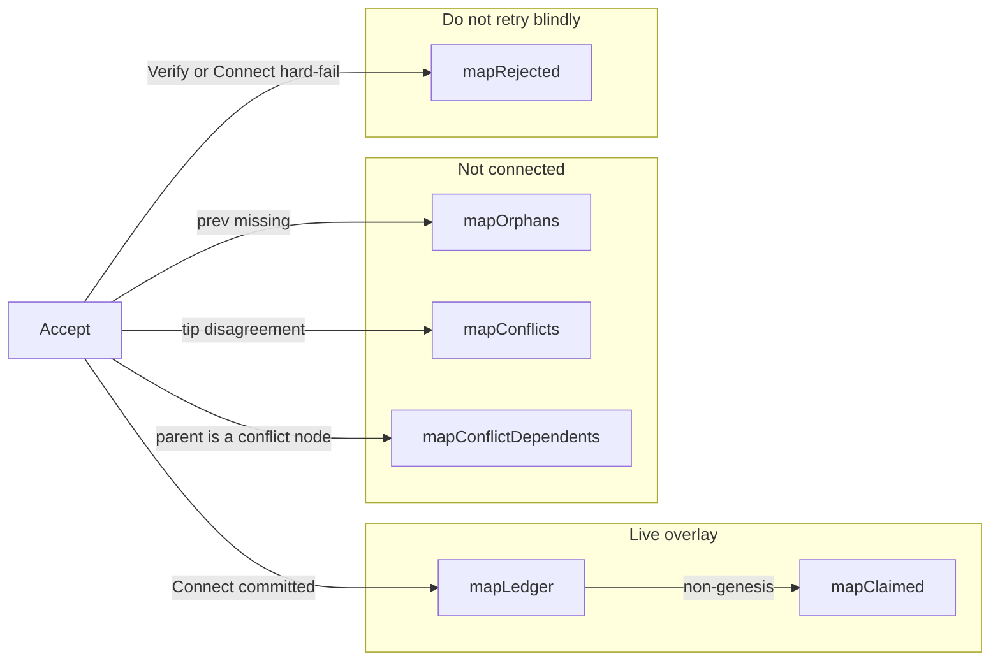
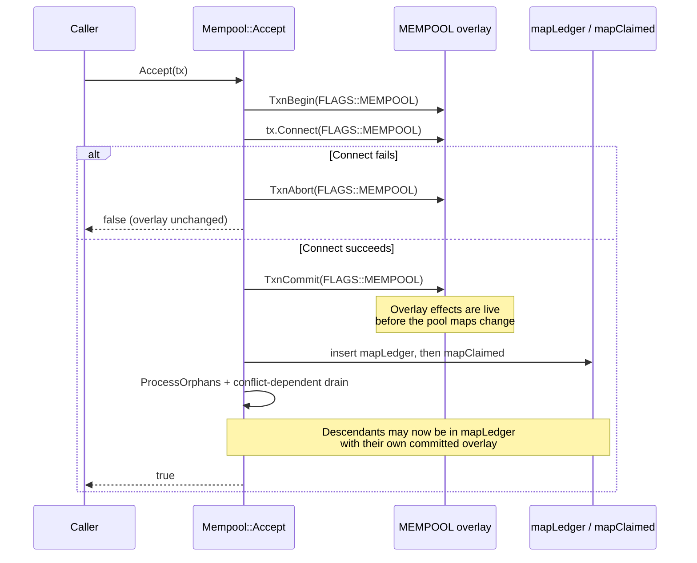
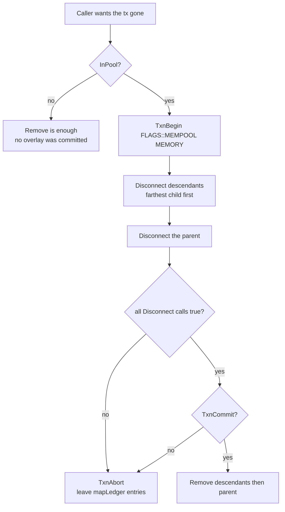
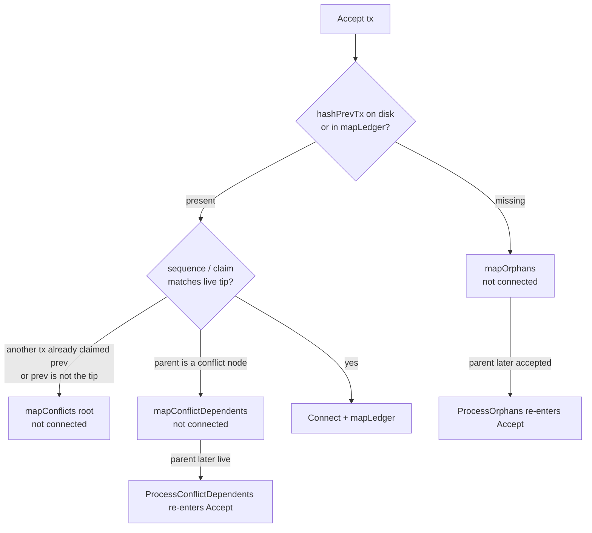

# Mempool semantics

**Status:** Current on NODE5  
**Scope:** `src/TAO/Ledger/types/mempool.h`, `src/TAO/Ledger/mempool.cpp`  
**Related:** [conflict DAG](MEMPOOL_CONFLICT_DAG.md), [mempool-only predecessor filter](MEMPOOL_ONLY_PREDECESSOR_FILTER.md), [BuildAndAccept](BUILD_CPP.md)

This document is the normative description of Tritium mempool admission, overlay ownership, and removal. Later agents must follow these rules. Do not infer that `Remove()` undoes register state, and do not infer that `Accept()` returning true means the transaction is in `mapLedger`.

---

## 1. What the mempool is

The mempool is the set of transactions that have been connected into the in-memory register overlay (`LLD` `FLAGS::MEMPOOL`) but are not yet committed in a block.

`Mempool::MUTEX` is a `std::recursive_mutex`. Every public method that touches pool maps takes it. Callers may also hold it across a multi-step accept / index / rollback sequence. Nested calls on the same thread are legal. A non-recursive lock must not be substituted.

Lock order when a caller also mutates SessionDB indexes:

1. `TAO::Ledger::mempool.MUTEX`
2. `TAO::API::Transaction::IndexLock(hashGenesis)`

Never acquire `mempool.MUTEX` while already holding `IndexLock`. `Indexing::BuildIndexes()` releases `IndexLock` before `BroadcastUnconfirmed()`, because that path calls `Accept()`.

---

## 2. Maps and what membership means

| Map | Key | Meaning |
|-----|-----|---------|
| `mapLedger` | tx hash | Live pool. `Connect(FLAGS::MEMPOOL)` has been committed. This is the only set `InPool()` reports. |
| `mapClaimed` | `hashPrevTx` → child hash | The live child that claims that predecessor. One slot. Used to walk a dependent tail. |
| `mapOrphans` / `mapOrphansByIndex` | missing prev / tx hash | Predecessor was not on disk and not in the live pool. Not connected. |
| `mapConflicts` | tx hash | Conflict **roots** only. Descendants are not inserted here. |
| `mapConflictDependents` | parent hash | At most one parked child per parent. Not connected, not error-relayed. |
| `mapConflictDependentsByIndex` | tx hash | Same parked dependents, keyed by their own hash. |
| `mapRejected` | tx hash | Hard reject. A later `Accept()` of the same hash fails closed. |
| `mapLegacy` / `mapLegacyConflicts` | tx hash | Legacy transactions. Not the Tritium sigchain tail. |

`Has(hash)` is broader than `InPool(hash)`. `Has` is true for live, legacy, conflict-root, parked-dependent, and orphan entries. `InPool` is true only for `mapLedger`.

---

## 3. Accept: connect is committed before the map insert

`Mempool::Accept()` holds `MUTEX` for the whole call, including `ProcessOrphans()` and `ProcessConflictDependents()`.

For a Tritium transaction that is eligible for the live pool, the success path is:

1. `LLD::TxnBegin(FLAGS::MEMPOOL)`
2. `tx.Connect(FLAGS::MEMPOOL)` — writes the register overlay
3. On connect failure: `TxnAbort(FLAGS::MEMPOOL)`. `DEFERRED_LOCAL_STATE` is **not** inserted into `mapRejected`. Other failures are.
4. `LLD::TxnCommit(FLAGS::MEMPOOL)` — the overlay is now durable for this process
5. `mapLedger[hashTx] = tx`
6. If not genesis: `mapClaimed[tx.hashPrevTx] = hashTx`
7. `ProcessOrphans(hashTx)` — may `Accept` one or more descendants, each of which repeats steps 1–6
8. `ProcessConflictDependents(hashTx)` — may admit a parked tail the same way
9. Relay `NOTIFY` / `TRANSACTION` when this node created the transaction (`pnode == nullptr`)

### Invariants

- **I1.** A transaction in `mapLedger` has already had `Connect(FLAGS::MEMPOOL)` committed. Erasing the map entry does not undo that connect.
- **I2.** `Remove(hash)` only erases pool maps (`mapLedger`, `mapClaimed`, orphans, conflicts, rejected, legacy). It does not call `Disconnect`.
- **I3.** To drop a live transaction, the caller must `Disconnect(FLAGS::MEMPOOL)` under `TxnBegin(FLAGS::MEMPOOL, INSTANCES::MEMORY)`, `TxnCommit` that memory transaction, and only then `Remove`. If disconnect or commit fails, `TxnAbort` and leave the map entry in place.
- **I4.** `Accept` of a parent can admit descendants before it returns. Rolling back only the parent leaves those descendants in `mapLedger` with a live predecessor claim. Walk `ClaimedDescendants` and disconnect **nearest child last** (reverse iteration), then the parent, in one MEMPOOL memory transaction.
- **I5.** `Accept` can return true without inserting `mapLedger` (orphan predecessor, or a path that parked the tx). Callers that index or broadcast a "live" tx must check `InPool(hash)`, not the boolean alone.
- **I6.** `mapClaimed` has one child per predecessor. `ClaimedDescendants` walks that chain, nearest first, and stops on a cycle, a missing `mapLedger` entry, or a guard past `mapLedger.size()`.
- **I7.** Conflict roots and parked dependents are not in the live overlay. Do not `Disconnect` them as if they had been connected. Do not cascade descendants into `mapConflicts`. See [MEMPOOL_CONFLICT_DAG.md](MEMPOOL_CONFLICT_DAG.md).

`Mempool::Check()` follows I3 for its own orphan-chain eviction: it holds `MUTEX`, opens `TxnBegin(FLAGS::MEMPOOL, INSTANCES::MEMORY)`, disconnects in reverse sequence order, and aborts rather than erasing if `Disconnect` throws or returns false.

---

## 4. Orphans versus conflicts

`ProcessOrphans` runs **before `Accept` returns**. Any code that treats "just accepted" as a single transaction is wrong if a dependent was waiting.

---

## 5. What not to do

- Do not call `Remove` on an `InPool` transaction without a successful MEMPOOL disconnect+commit.
- Do not disconnect a parent while a `mapClaimed` child is still connected.
- Do not hold `Transaction::IndexLock` and then call `Accept` / `Remove` (those take `mempool.MUTEX`). Take the pool lock first.
- Do not treat `Has(hash) == true` as "safe to index into SessionDB". Only `InPool` means the live overlay entry exists.
- Do not insert conflict descendants into `mapConflicts`. Park them.
- Do not add a `DEFERRED_LOCAL_STATE` connect failure to `mapRejected`. That blacklist would turn a stale height into a permanent wedge.

---

## 6. File map

| Symbol | File |
|--------|------|
| `Mempool::Accept` | `src/TAO/Ledger/mempool.cpp` |
| `Mempool::ProcessOrphans` | `src/TAO/Ledger/mempool.cpp` |
| `Mempool::InPool` / `Has` / `ClaimedDescendants` | `src/TAO/Ledger/mempool.cpp` |
| `Mempool::Remove` | `src/TAO/Ledger/mempool.cpp` |
| `Mempool::Check` | `src/TAO/Ledger/mempool.cpp` |
| Map declarations | `src/TAO/Ledger/types/mempool.h` |
