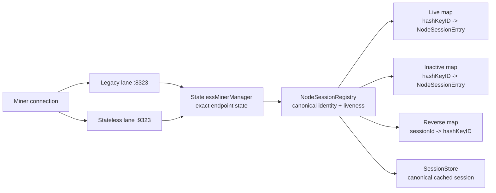
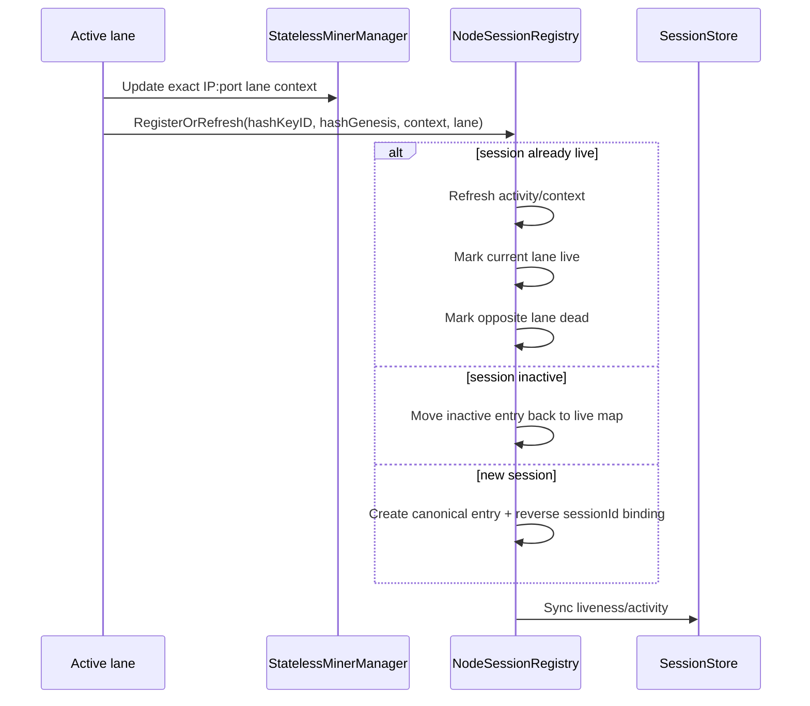
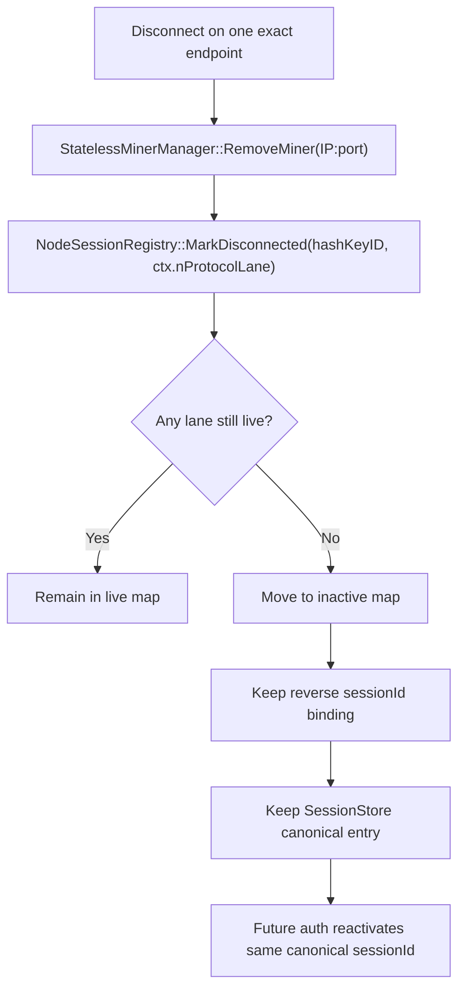

# Canonical Session Handling

**Last Updated:** 2026-04-15

This document describes how the mining node now treats session identity,
liveness, disconnects, and reactivation across the **legacy lane** (`8323`) and
the **stateless lane** (`9323`).

## Core Rules

- `NodeSessionRegistry` is the canonical session-identity and liveness store.
- `hashKeyID` is the canonical miner identity.
- `nSessionId` is deterministically derived from `hashKeyID`.
- Live lane state is tracked by exact endpoint (`IP:port`), not IP-only aliases.
- The registry separates:
  - **live runtime sessions**
  - **inactive cache entries**
- Normal disconnects do **not** delete canonical session state immediately; they
  demote it to inactive so the miner can re-authenticate onto the same session.

## Main Components

## Registration / Refresh Flow

On authentication or keepalive, the active lane calls
`NodeSessionRegistry::RegisterOrRefresh(...)`.

## Disconnect / Reactivation Flow

Disconnects are lane-specific.  A stale disconnect from one lane must not kill a
freshly reconnected endpoint on the other lane.

## Lane Wiring Expectations

### Stateless lane

- Seeds and mutates exact `IP:port` state in `StatelessMinerManager`.
- Uses the registry to:
  - recover canonical session ID
  - refresh keepalive liveness
  - demote only the stateless lane on disconnect

### Legacy lane

- Now seeds a pre-auth exact `IP:port` manager entry on connect.
- Uses the registry to:
  - reuse the canonical session ID on re-auth
  - refresh keepalive liveness
  - demote only the legacy lane on disconnect

## Regression Invariants

The unit tests and current code should preserve these invariants:

1. **Same `hashKeyID` → same canonical `nSessionId`**
2. **Only the current lane is live after a refresh/handoff**
3. **Disconnecting one lane must not clobber another live lane**
4. **When both lanes are down, the session remains cached as inactive**
5. **Re-auth from inactive state reuses the same canonical session**
6. **Reverse `sessionId -> hashKeyID` mapping is cleaned up on collision**

## Operational Notes

- `SweepExpired()` and inactive-budget enforcement only target inactive entries.
- Live sessions are authoritative runtime state and are not evicted to satisfy
  cache pressure.
- Missing Berkeley DB headers (`db_cxx.h`) block mining-object and unit-test
  builds; use `contrib/devtools/install-build-deps.sh` or the Copilot setup
  workflow to bootstrap them deterministically.
