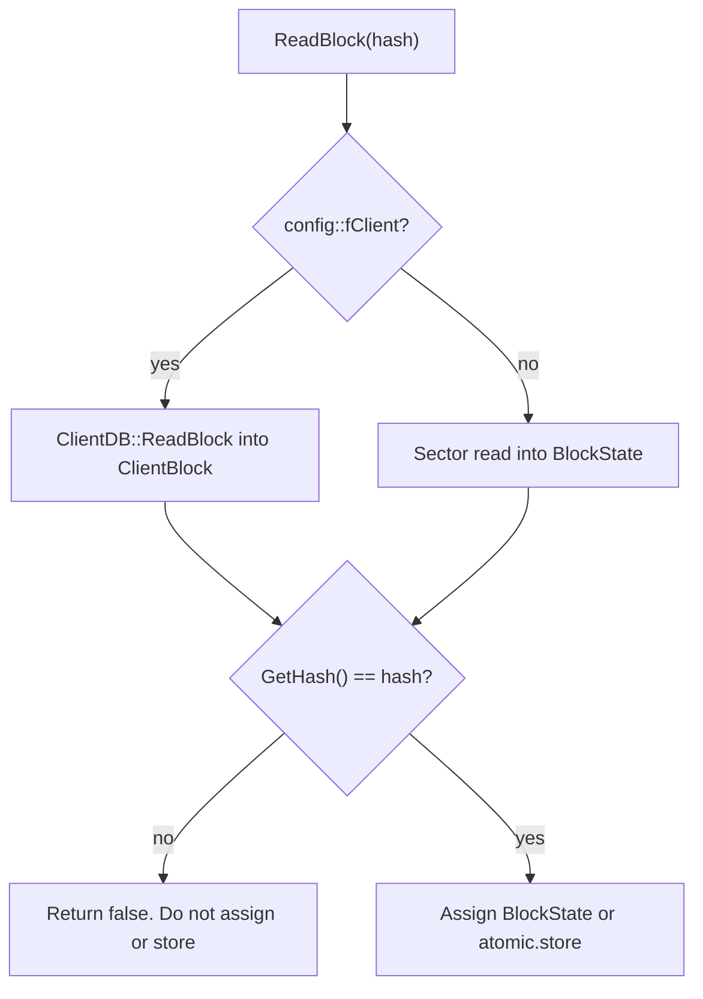

# LedgerDB hash-keyed block reads

`LedgerDB::ReadBlock(hash, BlockState&)` and `LedgerDB::ReadBlock(hash, atomic&)` both check the loaded record before publishing it to the caller. A mismatch returns false and leaves the caller's output unchanged.

Client mode uses `ClientDB` and still applies the same identity check. The non-client path uses the ledger sector record. Callers no longer have to repeat this comparison for these two hash-keyed reads.
