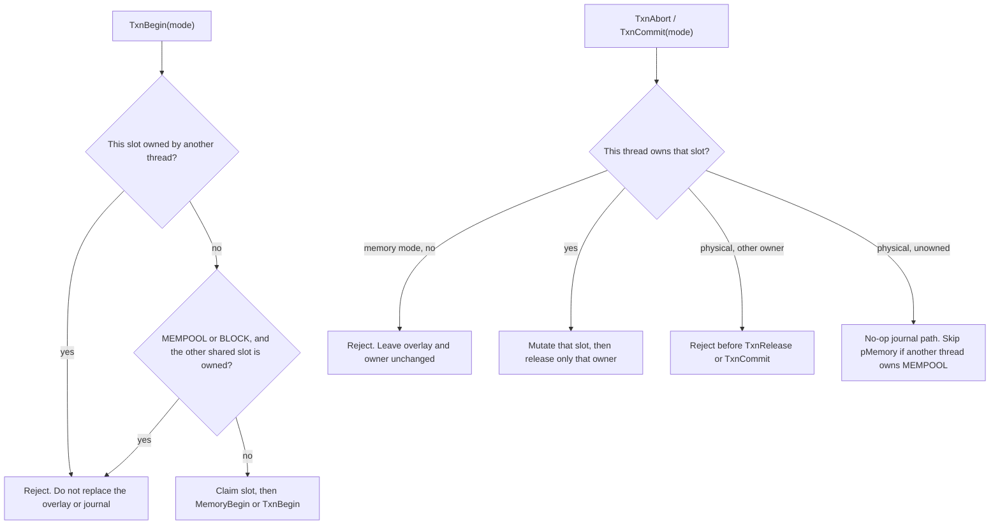

# LLD global transaction ownership

NODE5 does not use a cross-mode coordinator. `pMiner`, `pSanitize`, and the physical journal are process-wide, so MINER, SANITIZE, and the physical journal each have an owner slot. MINER and SANITIZE can stay open beside MEMPOOL. A slot mutex is held only across that slot's mutation. Shared-overlay checks lock the MEMPOOL slot before the physical slot.

`MemoryBegin` maps every flag other than MINER and SANITIZE onto the same process-wide `pMemory`. That includes `FLAGS::MEMPOOL` and physical `FLAGS::BLOCK`. Those two modes therefore share one overlay even though they have separate owner slots. `TxnBegin` rejects the second begin, whether it comes from another thread or the same thread, before `MemoryBegin`. A rejected begin does not replace the overlay or open the physical journal.

MINER and SANITIZE `TxnCommit` stays a no-mutation short-circuit. It returns true when this thread owns that mode or owns nothing. It returns false when this thread owns a different mode, and it does not release that owner.

A physical commit applies the BLOCK-created `pMemory` only when this thread owns the physical slot and no other thread owns MEMPOOL. It does not commit or delete an overlay owned by another thread. Begin-time rejection is what keeps those two owners from being created together.
