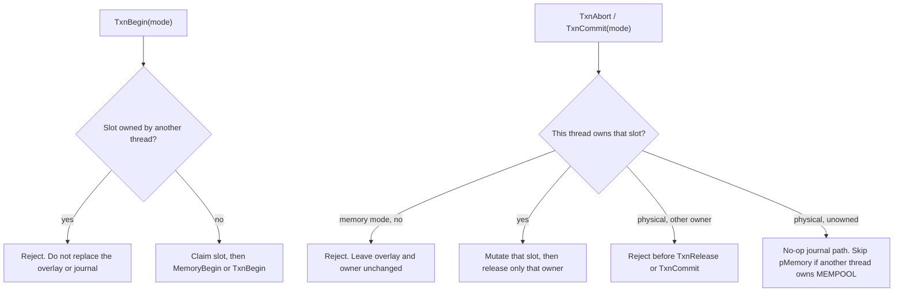

# LLD global transaction ownership

NODE5 does not use a cross-mode coordinator. `pMemory`, `pMiner`, `pSanitize`, and the physical journal are process-wide, so each mode has its own owner slot. MINER, SANITIZE, and MEMPOOL can stay open together. A slot mutex is held only across that slot's mutation.

MINER and SANITIZE `TxnCommit` stays a no-mutation short-circuit. It returns true when this thread owns that mode or owns nothing. It returns false when this thread owns a different mode, and it does not release that owner.

A physical commit applies `pMemory` only when this thread owns the MEMPOOL slot. It does not commit or delete an overlay owned by another thread.
