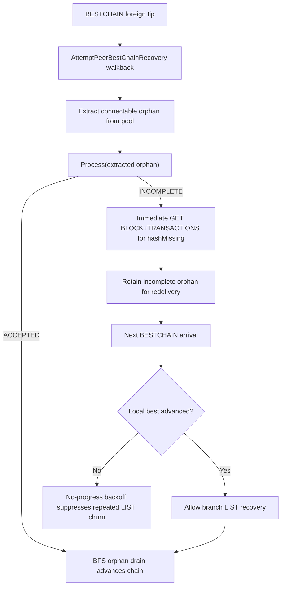

# PR #697 Production Regression Hotfix

This diagram captures the patched recovery path for the production orphan/BESTCHAIN
doom-loop class observed after PR #697.

## Extracted incomplete orphan + no-progress backoff

### Operational effect

- Incomplete extracted connectable orphans now trigger immediate missing-transaction
  recovery instead of waiting for unrelated redelivery.
- Repeated far-tip recovery LIST traffic is suppressed when the local best hash/height
  have not advanced between attempts, reducing reconnect/orphan-limit loop pressure.
