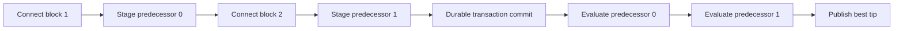
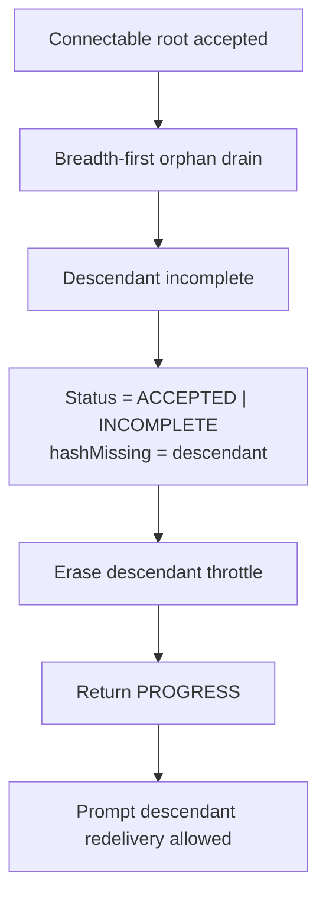
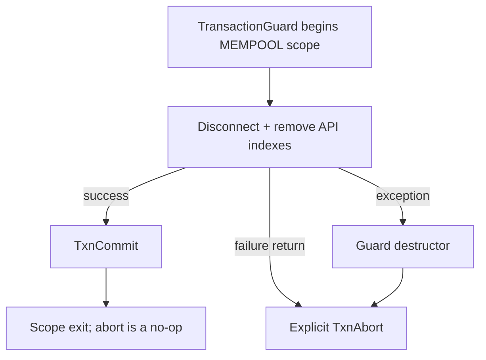

# PR #697 Review Hardening

These diagrams document the three follow-up invariants applied after review of
the transaction, checkpoint, and orphan-recovery changes.

## Ordered checkpoint publication

Every connected predecessor is evaluated after commit in ascending order. A
newer, immature candidate therefore cannot suppress an earlier matured one.

## Accepted root with incomplete descendant

The throttle key comes from `block.hashMissing`; using the accepted root's hash
would leave the incomplete descendant rate-limited.

## Exception-safe mempool cleanup

All exits release the shared transaction coordinator, including exceptions
thrown after `Disconnect()`.
