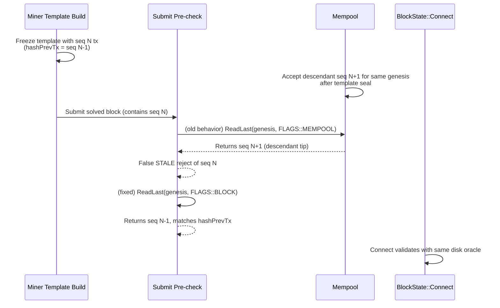

# Sigchain "last" Resolution (Canonical)

This document defines the canonical resolution model for sigchain `last` during block pre-checks and connect-time validation.

## Two-Oracle Model

| Mechanism | Scope | Answers |
|---|---|---|
| `mapLast` | In-flight (within this block's `vtx`) | What will `WriteLast()` have written by the time `Connect()` reaches this tx? |
| `ReadLast` (disk, `FLAGS::BLOCK`) | Committed chain state | What's the last tx for this genesis actually on disk? |

## Precedence Rule

Resolve `last` in this order:

1. `mapLast` (in-block, in-flight writes)
2. Disk `ReadLast(..., FLAGS::BLOCK)`

No mempool peek is allowed in this pre-check path. This is the same precedence used by `TAO::Ledger::BlockState::Connect()`.

## Production Race That Motivated PR #612

## Oracle-Consistency Invariant

A pre-check that predicts an authoritative operation **must** consult the same state oracle that the authoritative operation consults.

- If the authoritative path reads disk, the pre-check must read disk.
- Reading a different oracle (mempool/sessions) can produce false rejects or false accepts.

## Why Disk-Only Is Safe at Submit Time

The `create.cpp` channel-agnostic Option-B mempool-only-predecessor filter ensures every `vtx` predecessor is already **on-disk-or-in-block** before submission. With `mapLast` covering in-block chaining, disk-only fallback is both sufficient and consistent with connect-time behavior.

## Source References

- `src/TAO/Ledger/stateless_block_utility.cpp` (`ValidateVtxSigchainConsistency`)
- `src/TAO/Ledger/state.cpp` (`BlockState::Connect`)
- `src/LLD/ledger.cpp` (`LedgerDB::ReadLast`)
- PR #612: <https://github.com/NamecoinGithub/LLL-TAO/pull/612>
